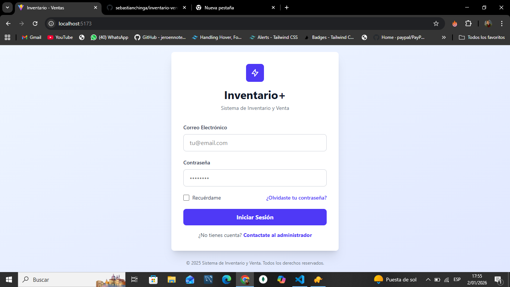
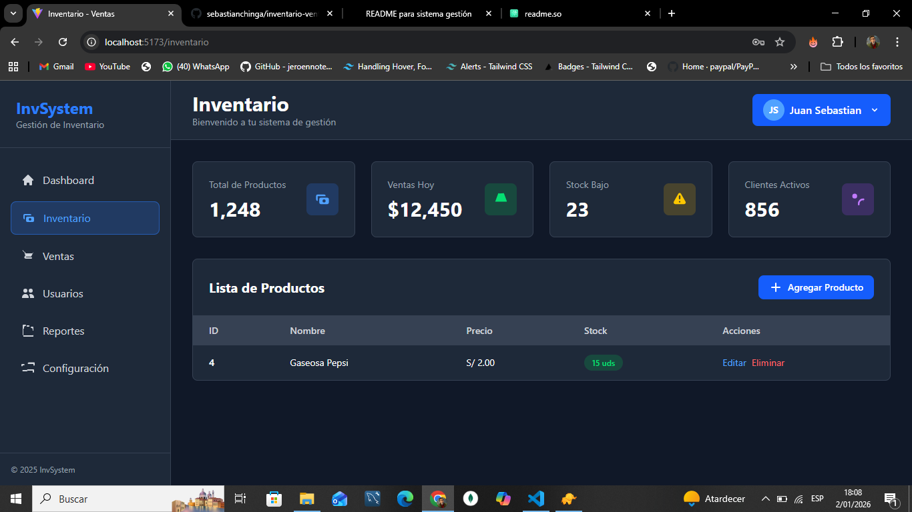
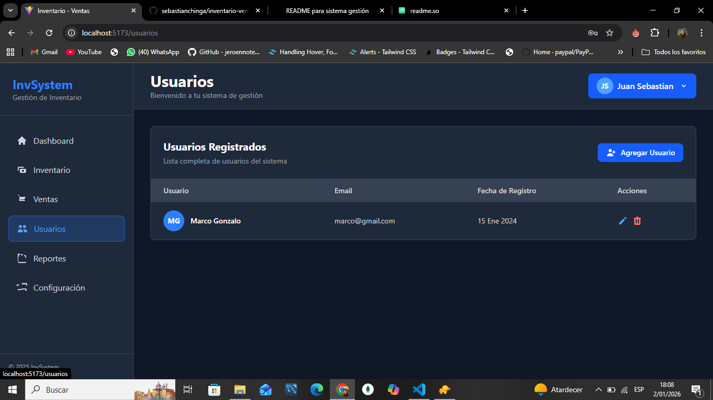
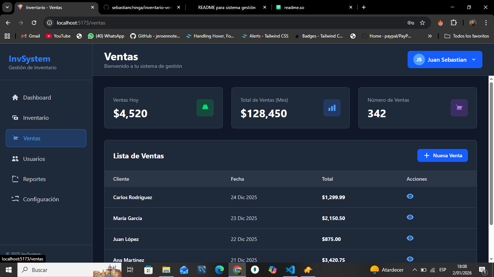

# 🛒 Sistema de Gestión de Ventas

Sistema web para la **gestión de productos, usuarios/vendedores y ventas**, desarrollado con tecnologías modernas tanto en el backend como en el frontend.  
El objetivo es centralizar el control de inventario y ventas con autenticación segura y una interfaz limpia.

---

## 🚀 Tecnologías utilizadas

### Backend
- **Node.js**
- **Express**
- **JWT (JSON Web Tokens)** para autenticación
- **Axios** (consumo de APIs desde el frontend)

### Frontend
- **React**
- **Context API** (manejo de estado global)
- **Tailwind CSS** (estilos)
- **Axios**

---

## ✨ Funcionalidades principales

- Autenticación de usuarios mediante JWT
- Gestión de usuarios y vendedores
- CRUD de productos
- Registro de ventas
- Control de acceso según usuario
- Interfaz moderna y responsiva

---

## 📸 Capturas del sistema

### 🔐 Login


### 📦 Gestión de productos


### 👤 Gestión de usuarios / vendedores


### 🧾 Registro de ventas


> 📌 **Nota:** Las imágenes deben estar dentro de la carpeta `screenshots/` en la raíz del proyecto.

---

## ⚙️ Instalación y ejecución

### Backend

```bash
cd backend
npm install
npm run dev
```

### Frontend

```bash
cd frontend
npm install
npm run dev
